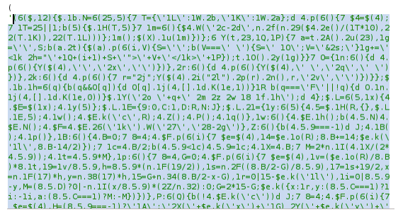
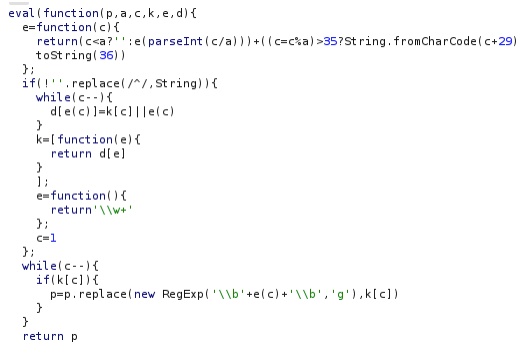
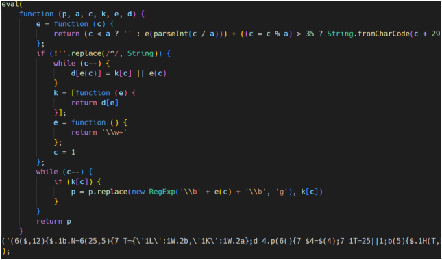
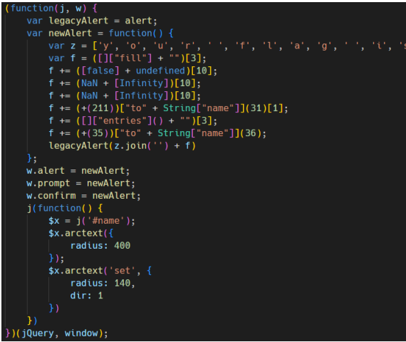
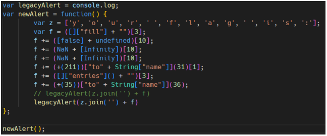

# Challenge - Cool Name Effect

**Difficulty**: Easy  
**Vulnerability**: PACKER JavaScript Obfuscation

## 🔍 Initial Analysis
Suspicious code in `<script>` tag is PACKER JavaScript Obfuscation.  

Also in `<script>` tag have a function to decrypt it.  

## ⚔️ Exploitation
Install NodeJS

Copy the decrypt function into a `.js` file.  

Change the `return p;` to `console.log(p)` and execute it with NodeJS.  
After execute successfully, copy all output into the second `.js` file. This output is the origin code.

We observe the JS code, there is a suspicious function:

Adjust code a little bit like this:  
  

Then execute the second `.js` file with NodeJS.