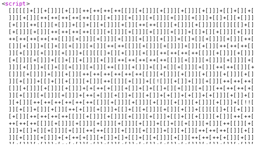

# Challenge - Iam Legend

**Difficulty**: Easy  
**Vulnerability**: JSFuck Obfuscation Leak

## 🔍 Initial Analysis
Use Buite Suite to catch the request. We observe a type of obfuscated JS which is **JSFuck** in `<script>` tag.

## ⚔️ Exploitation
Use **de4js** tool to deobfuscate JSFuck.
Extracted condition: `user == Cyber && pass == Talent`.