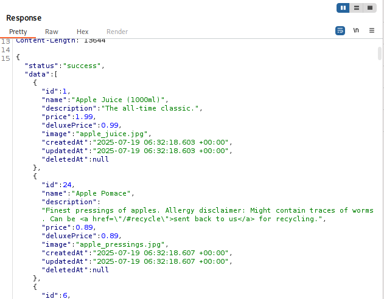
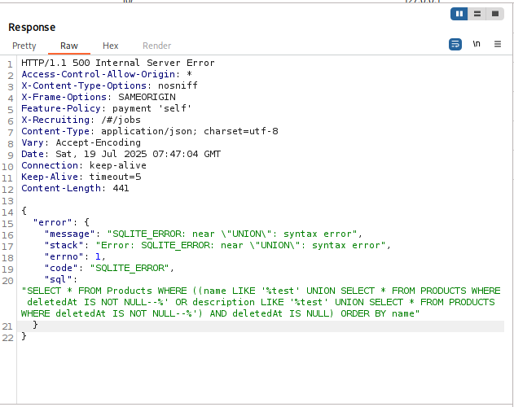
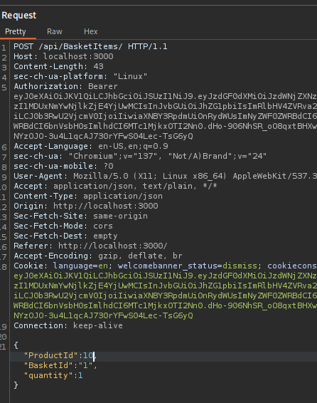
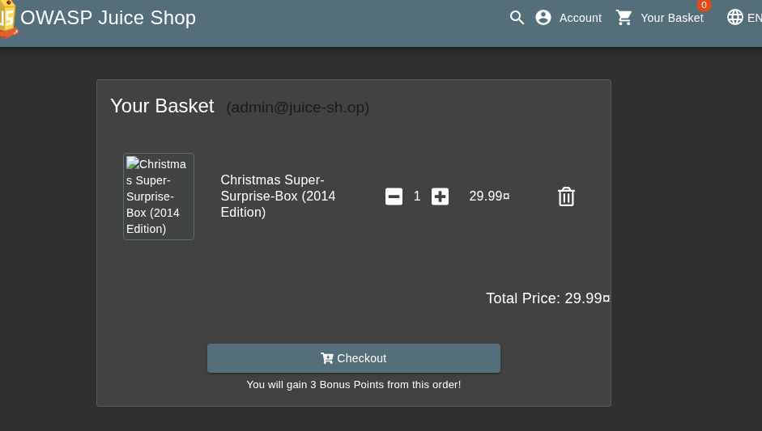

# Juice Shop Writeup: Christmas Special

## Challenge Overview
**Title**: Christmas Special 
**Category**: Injection  
**Difficulty**: ⭐⭐⭐⭐ (4/6)  
**Goal**: Order the Christmas special (hidden products) offer of 2014.

## Tools used
Burp Suite: Use Interception Proxy to catch request/response packet between client and server.

## Exploit  
### Step 1: Use Burp Suite to catch request/response.  
- After capturing the packet, go to the **HTTP history** tab, find the URL `/rest/products/search?q=`. Look at **Response** session, we will see the data in JSON format as shown below:  
  
- In this data, we see `deleteAt` line is `NULL, which mean this product is not deleted/hidden.  

### Step 2: Inject SQL query to request packet
- Inject SQL query `test' UNION SELECT * FROM Products WHERE deletedAt IS NOT NULL--` to the URL `/rest/products/search?q=`, the response packet will look like this:  
  
- We have triggered SQL syntax error, which also leaked the query is used to search for product.  
```
SELECT * FROM Products
WHERE ((name LIKE '%test'
UNION
SELECT *
FROM Products
WHERE deletedAt IS NOT NULL--%' OR description LIKE '%test' UNION SELECT * FROM Products WHERE deletedAt IS NOT NULL--%') AND deletedAt IS NULL) ORDER BY name"
```
- Now let's tweak the SQL query that we injected above `test')) UNION SELECT * FROM Products WHERE deletedAt IS NOT NULL--`. We will get all the product that have been hidden.

### Step 3: Adding the product to basket.
- Add a product to basket and use Burp Suite to capture the POST packet and modify it. From Change the number of `ProductId` to  `10`.  
  
  
- Now purchase the product to complete the challenge.

# Explanation
This challenge was resolved by utilizing a branch of SQL Injection which is Blind SQL Injection. 